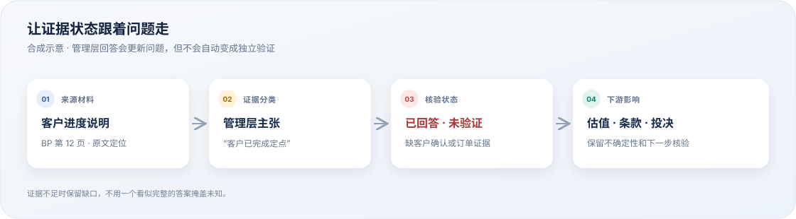
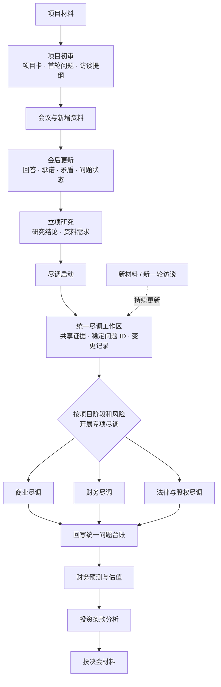

<h1>股权投资 Agent Skills</h1>

<strong>让投资分析从“读材料”走到“可追溯的决策工作流”</strong>

面向股权投资项目的 Agent Skills：从项目初审、会议更新与尽职调查，到预测估值、投资条款和投决材料，持续维护证据、问题状态和投资影响。

  
  
  

  

  <strong>回答不等于验证。</strong> 每项重要结论都应保留来源、证据状态、未解决问题和下游影响。

---

## 这个项目解决什么问题

投资材料中的历史事实、管理层主张、预测和计划经常混在一起；问题在会议后容易失去上下文；商业、财务和法律尽调的结论又需要汇入同一套估值、条款和投决依据。

本项目提供一组可组合的工作规范，让 Agent 协助投资团队：

- 阅读多种格式的项目材料，生成项目卡、首轮问题和访谈提纲；
- 将会议回答、新增资料、承诺和矛盾回写到原有问题状态；
- 维护跨商业、财务、法律尽调的证据与问题台账；
- 把未解决事项传递到预测估值、投资条款和投决材料；
- 对缺失证据明确标记“待验证”“未披露”或“无法确认”，而不是补齐看似完整的答案。

这是 Agent 的分析工作流与质量约束，不是固定关键词抽取器，也不是可替代投资人或专业顾问的自动投决产品。

## 工作流一览

每个项目不一定需要完整走完所有环节。应按阶段选择适用的 Skill，并在后续轮次保留前一轮结论、来源和变更记录。

## 核心设计

| 设计 | 如何落实 |
| --- | --- |
| 证据可追溯 | 记录文件、页码、章节、链接、日期、期间、币种和单位等来源定位 |
| 状态不混淆 | 区分材料事实、管理层主张、外部资料、Agent 推导、模拟输入、待验证和矛盾 |
| 问题可延续 | 使用稳定的 <code>issue_id</code>，在会议更新和不同尽调工作流间维护状态与变更历史 |
| 影响能下传 | 把问题映射到可投资性、估值、持股、交割、保护条款和投决输入 |
| 人类保留责任 | Agent 协助整理、计算、追问和起草；投资判断及专业结论由相应人员复核 |

### 一个简化示例

> **材料中的说法：**“客户已完成定点”
>
> **当前证据：**管理层主张，尚无客户订单或客户确认
>
> **会议后的状态：**已回答，但未验证
>
> **下游处理：**保留为未解决问题，并把不确定性带入收入预测与估值分析

以上为工作方式示意，不代表真实项目或实际投资结论。

## Skill 清单

仓库包含 11 个可独立调用、也可按流程组合的 Skill。

| 阶段 | Skill | 主要输出 |
| --- | --- | --- |
| 初审 | [project-intake-and-project-card](skills/project-intake-and-project-card/SKILL.md) | 项目卡、首轮问题清单、访谈提纲 |
| 会后更新 | [update-project-card-from-meeting](skills/update-project-card-from-meeting/SKILL.md) | 更新后的项目卡、问题状态、变更摘要、未闭环事项 |
| 立项研究 | [project-initiation-research-and-memo](skills/project-initiation-research-and-memo/SKILL.md) | 立项研究报告、研究结论、资料需求 |
| 尽调启动 | [due-diligence-intake-and-request-list](skills/due-diligence-intake-and-request-list/SKILL.md) | 尽调启动判断、资料清单和核验任务 |
| 统一工作区 | [due-diligence-workspace-and-issue-ledger](skills/due-diligence-workspace-and-issue-ledger/SKILL.md) | 跨工作流问题台账、证据和下游输入 |
| 商业尽调 | [commercial-due-diligence-analysis](skills/commercial-due-diligence-analysis/SKILL.md) | 市场、客户、竞争、商业化与单位经济分析 |
| 财务尽调 | [financial-due-diligence-analysis](skills/financial-due-diligence-analysis/SKILL.md) | 收入质量、现金流、营运资本和异常分析 |
| 法律与股权尽调 | [legal-due-diligence-analysis](skills/legal-due-diligence-analysis/SKILL.md) | 股权、治理、合同、知识产权和法律风险分析 |
| 预测与估值 | [financial-forecast-and-valuation](skills/financial-forecast-and-valuation/SKILL.md) | 财务预测、估值区间、持股和退出情景 |
| 投资条款 | [investment-terms-analysis](skills/investment-terms-analysis/SKILL.md) | 条款工作包、谈判问题、交割条件和保护措施 |
| 投决会 | [investment-committee-decision-memo](skills/investment-committee-decision-memo/SKILL.md) | 投决材料、决策条件和待决事项 |

商业、财务和法律尽调负责各自领域分析；统一工作区负责关联证据和问题；估值、条款及投决工作流引用这些共享输入。

## 快速开始

### 1. 获取仓库

<pre><code>git clone https://github.com/MXmingxuan/MXmingxuan-equity-investment-skills.git
cd MXmingxuan-equity-investment-skills</code></pre>

### 2. 安装需要的 Skill

在支持 Agent Skills 的宿主中，将所需的 <code>skills/&lt;skill-name&gt;</code> 目录导入或复制到宿主的 Skill 目录。初次阅读 BP，可从 <code>project-intake-and-project-card</code> 开始；进入尽调后，再按需加入统一工作区和专业尽调 Skill。

请按照所用宿主的文档确认 Skill 安装位置与格式支持。每个 Skill 的 <code>SKILL.md</code> 说明适用场景、输入、边界、工作步骤和输出要求。

### 3. 提供材料并调用

<pre><code>请使用 project-intake-and-project-card 阅读我提供的项目材料，
输出项目卡、优先级问题清单和首次访谈提纲。
对重要数字标注来源位置、单位、期间和证据状态。</code></pre>

演示或测试时请使用明确标注的合成材料。真实项目材料只能放在获得授权且符合机构政策的环境中。

## 支持的材料与输出

具体输入取决于所调用的 Skill，可包括：

- **项目材料**：PDF、DOCX、Markdown、纯文本和网页链接；
- **商业资料**：公司介绍、产品资料、客户及订单资料、市场材料；
- **财务资料**：财务报表、科目余额表、总账、流水、预算、预测和 Excel 数据；
- **法律资料**：股东名册、章程、合同、工商档案、知识产权和诉讼材料；
- **过程资料**：会议纪要、访谈记录、邮件跟进、管理层回答、新增数据和承诺。

输出可以包括 Markdown 分析、结构化 JSON、问题台账和财务工作簿。不同格式的项目名称、数值、问题 ID、证据状态、来源和结论应保持一致。

## 中文输出规范

面向用户的项目卡、问题清单、访谈提纲、报告、台账说明和结论默认使用简体中文。公司、人名、机构和产品官方名称、文件名、URL、代码、JSON/YAML 字段、稳定 ID 及必要专业缩写可以保留原文；重要的英文缩写首次出现时应附中文释义。原始材料引文可保留原语言，但 Agent 的分析和结论使用中文。

## 证据规则与专业边界

重要信息应标明其属于材料事实、管理层主张、外部公开资料、Agent 计算或推导、模拟输入、待验证、存在矛盾、未披露或无法读取。

不能把预测和目标写成历史实际，也不能把口头回答、提供材料的承诺或搜索线索写成独立验证。来源不足时应明确说明缺口，并提出下一步核验方式。

本项目辅助投资团队整理证据、维护问题状态和起草分析材料，不能替代：

- 投资人对估值、风险承受能力和最终投决的责任；
- 律师对股权、合同、知识产权和交易文件的法律意见；
- 会计师或审计师对财务报表、会计处理和税务事项的专业判断；
- 商业顾问、技术专家、客户访谈和现场核验。

## 隐私与公开仓库边界

公开仓库只保存通用 Skill、规范、模板和明确标注的合成案例。真实 BP、会议纪要、客户资料、财务数据、交易材料和真实项目输出均可能包含敏感信息，不应上传到公开仓库。

当前 <code>.gitignore</code> 忽略 <code>outputs/</code>、常见项目材料格式、对话导出文件、<code>.case-materials/</code> 和本地临时文件。被忽略不代表可以忽略提交前检查；提交前应查看工作区状态、忽略规则和暂存文件，切勿强制加入敏感资料。

## 开发与验证

修改 Skill 后，请检查入口元数据、调用提示、输入与输出约定、本地引用路径、问题 ID 和证据状态是否一致。也要确认示例均明确标注为合成输入，且没有意外包含真实项目名称、材料或输出。

这些检查只能帮助发现结构和表达问题，不能验证投资分析质量，也不能代替投资人或专业人士复核。

## 后续方向

可根据实际使用反馈继续补充技术、税务、ESG 和监管许可等专项流程，并完善行业化模板、数据室连接、跨版本比较和证据关联能力。新增 Skill 前先确认它在投资流程中的位置，避免与现有工作重复。

## 免责声明

本项目提供 Agent 工作流、证据整理和决策辅助规范，不构成投资建议、法律意见、审计意见、税务意见、估值认证或投资承诺。正式投资决策、交易文件和专业结论，应由具备相应职责和资质的人员基于完整材料独立复核。
